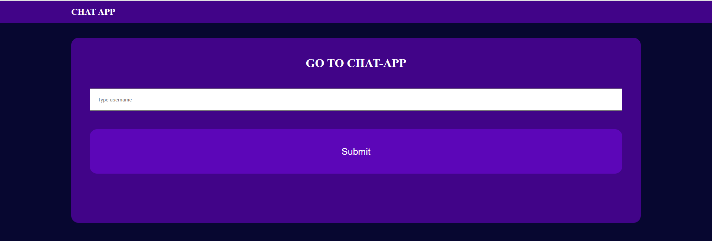
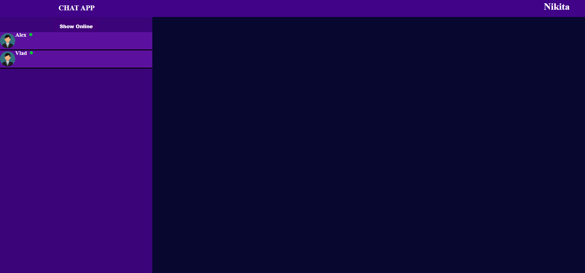
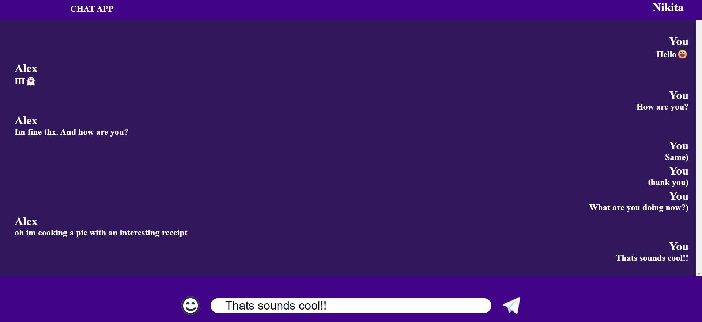
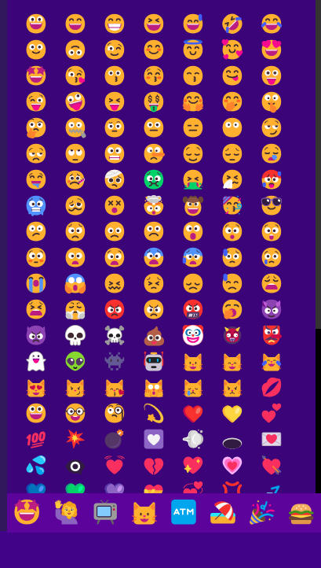

<h1> CHAT APP PROJECT</h1>
<h2> This project was developed using react, redux (redux toolkit), typescript, html, scss and nodejs </h2>
<h2>When you launch react app you will be taken to the start menu: </h2>

<h2>Here you must enter any username and after submitting   you will be redirected to Account page where you can select online users to chat  </h2>

<h2> If you click at any user you will be redirected to private room where you can chat with selected user  </h2>

<h2> You can alsi use different smileys here!  </h2>

<h1> Thank for attention!!! :)</h1>